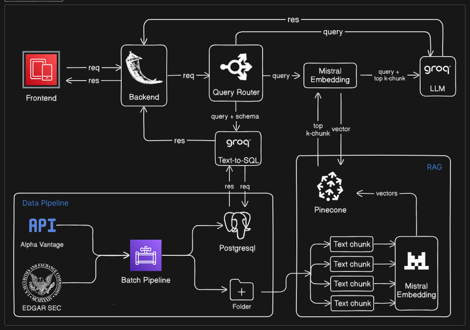
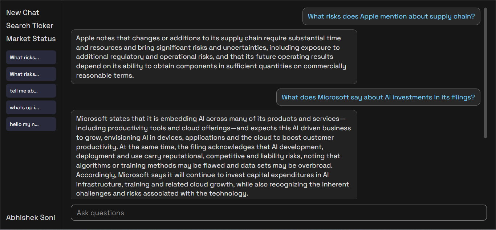
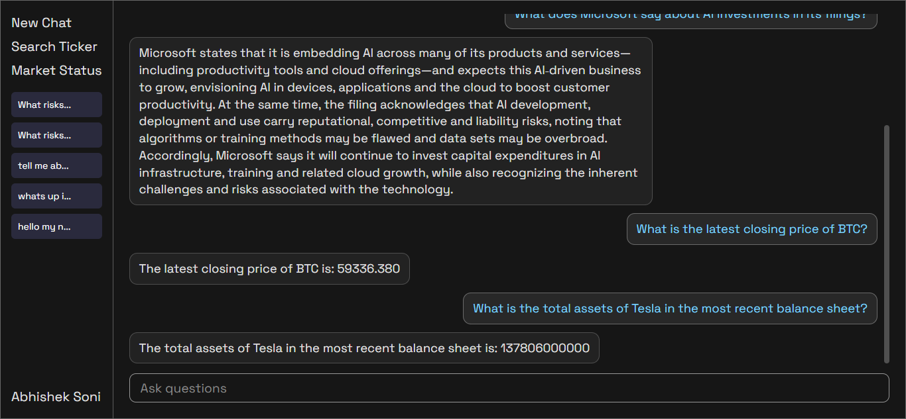
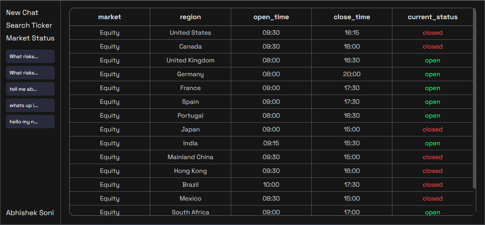
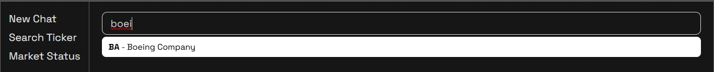

# 🚀 FinNews

**FinNews** is an AI-powered financial intelligence platform that allows users to **ask questions about financial markets, company filings, and financial data using natural language**.

The system combines **Retrieval-Augmented Generation (RAG)** with **Text-to-SQL** to answer both **unstructured financial document queries** and **structured financial database queries** through a single conversational interface.

---

## 🌟 Features

- 🤖 **AI Financial Chat**  
  Ask questions about company filings and financial reports in natural language.

- 📄 **SEC Filing Analysis (RAG)**  
  Extract insights from company filings such as risk factors, strategies, and disclosures.

- 🧠 **Text-to-SQL Querying**  
  Convert natural language questions into SQL queries to fetch financial data.

- 📊 **Market Status Dashboard**  
  View real-time open/close status of global equity markets.

- ⚡ **Intelligent Query Routing**  
  Automatically routes queries to either the **RAG pipeline** or **SQL database** depending on the query type.

---

## 🏗️ System Architecture



The platform consists of three major components:

### 1️⃣ Frontend
Provides the user interface for:
- AI chat interface
- Company ticker search
- Global market status dashboard

### 2️⃣ Backend
Handles request processing and query routing.

Components include:
- Query Router
- RAG Pipeline
- Text-to-SQL Generator
- API endpoints

### 3️⃣ Data Pipeline
Collects and processes financial data from external sources.

Tasks include:
- Fetching financial data
- Processing SEC filings
- Chunking and embedding documents
- Storing structured data in PostgreSQL
- Storing vector embeddings in Pinecone

---

## 🧠 AI Pipelines

### 🔹 RAG Pipeline

Used for **document-based financial queries**.

Process:

1. Convert query to embedding  
2. Retrieve relevant document chunks from Pinecone  
3. Send context + query to LLM  
4. Generate answer  

---

### 🔹 Text-to-SQL Pipeline

Used for **structured financial data queries**.

Process:

1. User query + database schema → LLM  
2. LLM generates SQL query  
3. Query executed in PostgreSQL  
4. Result returned to user  

---

## 🛠️ Tech Stack

**Frontend** : HTML, CSS, JavaScript
**Backend** : Python, Flask
**AI / LLM** : Groq LLM, Mistral Embeddings, Retrieval-Augmented Generation
**Databases** : PostgreSQL, Pinecone
**Data Sources** : Alpha Vantage API, SEC EDGAR Filings

---

## 📊 Example Queries

### Document-based queries

```
What risks does Apple mention about supply chain?
```

```
What does Microsoft say about AI investments in its filings?
```

### Financial data queries

```
What is the latest closing price of BTC?
```

```
What is the total assets of Tesla in the most recent balance sheet?
```

---

## 📸 Screenshots

### AI Financial Chat




### Market Status Dashboard



### Company Search



---

## 🔮 Future Improvements

- 📈 Advanced financial analytics
- 📊 Interactive market dashboards
- ⚡ Real-time financial data streaming
- 🐳 Docker deployment

---
